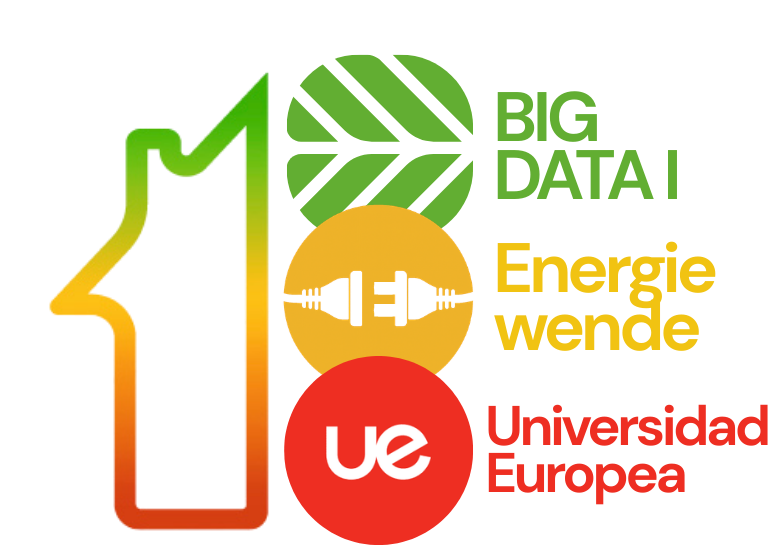
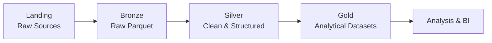
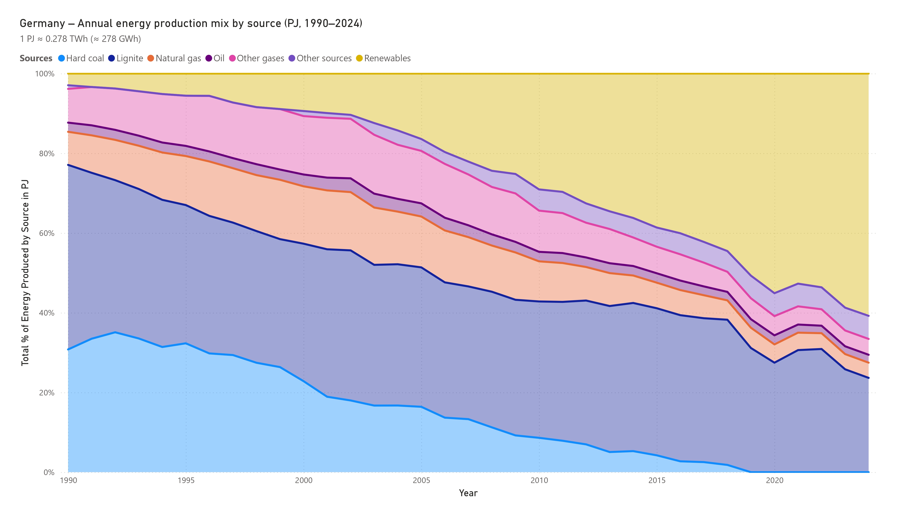
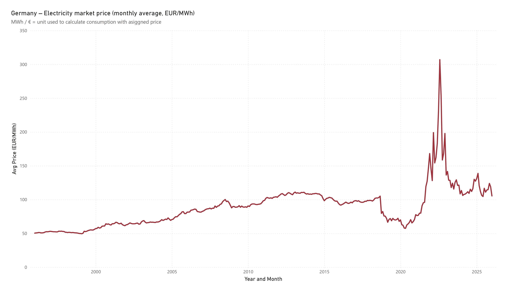
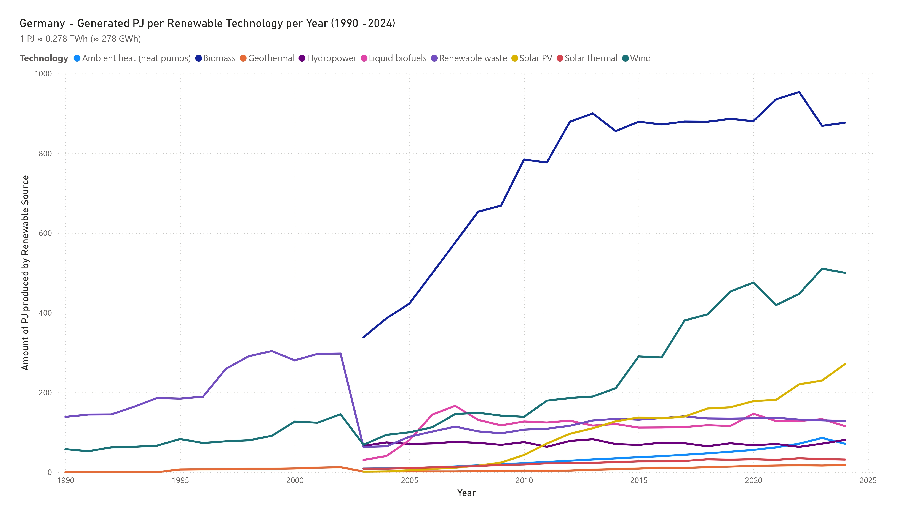

<p align="center">
  
</p>

<p align="center">
  Germany Energy Transition — Data Engineering Pipeline
</p>

<p align="center">
  
  
  
</p>

---

## Overview

This project analyzes the German energy transition using official public datasets.

A complete **ETL pipeline with Apache Spark** was implemented to transform heterogeneous energy data into structured analytical datasets suitable for analysis and business intelligence.

The system follows a **lakehouse architecture**, ensuring reproducibility, traceability and a clear separation between raw data, transformations and analytical outputs.

The resulting datasets enable the exploration of:

- the evolution of Germany’s energy mix
- renewable expansion by technology
- electricity market price dynamics
- nuclear phase-out context
- energy consumption by sector

---

## Architecture

The project follows a lakehouse architecture separating raw ingestion, transformation and analytical layers.



---

## Data Sources

| Source   | Type | Content                                                 |
| -------- | ---- | ------------------------------------------------------- |
| SMARD    | API  | German electricity generation, demand and market prices |
| AGEB     | File | German energy balances and structural indicators        |
| Eurostat | File | European energy price indicators                        |
| OPSD     | File | Historical electricity generation and demand            |
| EEA      | File | National greenhouse gas emissions                       |

All sources are official European or German institutions, ensuring data reliability and traceability.

---

## Project Structure

```
data/
├── landing/          # Raw data from sources
├── bronze/           # Raw datasets materialized in Parquet
├── silver/           # Cleaned and normalized datasets
└── gold/             # Analytical datasets ready for analysis
```

---

## Analytical Datasets (Gold Layer)

| Dataset                            | Source           | Frequency       | Description                                          |
| ---------------------------------- | ---------------- | --------------- | ---------------------------------------------------- |
| energy_mix_total                   | AGEB             | Annual          | Total German energy mix and relative share by source |
| energy_intensity_indicators        | AGEB             | Annual          | Aggregated energy efficiency indicators              |
| final_energy_consumption_by_sector | AGEB             | Annual          | Final energy consumption by sector                   |
| renewables_by_technology           | AGEB             | Annual          | Renewable production by technology                   |
| daily_electricity_profile          | OPSD             | Daily           | Electricity load and renewable share                 |
| latest_energy_day                  | SMARD            | Hourly snapshot | Latest full day of electricity system data           |
| electricity_price_trends_monthly   | SMARD / Eurostat | Monthly         | Electricity price trends                             |
| nuclear_exit_context_monthly       | SMARD            | Monthly         | Nuclear phase-out context                            |

All datasets are stored in **long format with consistent temporal typing and explicit units**.

---

## Analytical Insights

### Energy Mix Evolution



Renewables have steadily expanded since the early 2000s, progressively replacing coal and nuclear generation in Germany’s energy system.

---

### Electricity Market Prices



Electricity prices remained relatively stable for many years before experiencing strong volatility during the European energy crisis.

---

### Renewable Generation by Technology



Wind power dominates renewable electricity generation, followed by biomass and solar, illustrating the technological composition of Germany’s renewable expansion.

---

## Reproducibility

The entire ETL pipeline can be reproduced using the provided **Makefile**.

Example workflow:

```
make bronze
make silver
make gold
```

To rebuild the entire pipeline:

```
make refresh-all
```

---

## Authors

|                                                                |                                                                     |
| :------------------------------------------------------------: | :-----------------------------------------------------------------: |
|  |  |
|                    **Tomás Morales Galván**                    |                    **Miguel Bachiller Segovia**                     |
|      [@Tomasmoralessp](https://github.com/Tomasmoralessp)      |   [@MIGUELBACHILLERGH55](https://github.com/MIGUELBACHILLERGH55)    |
